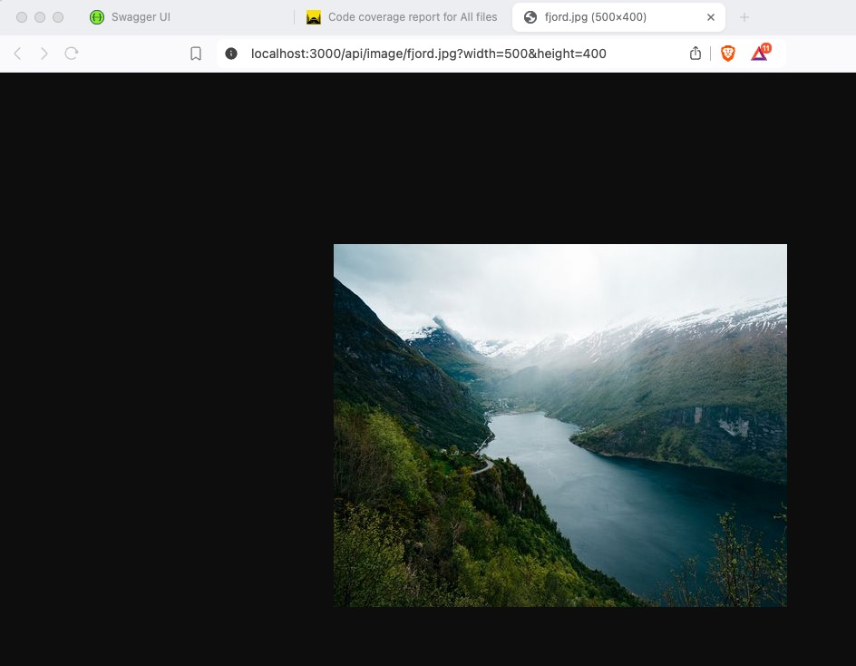
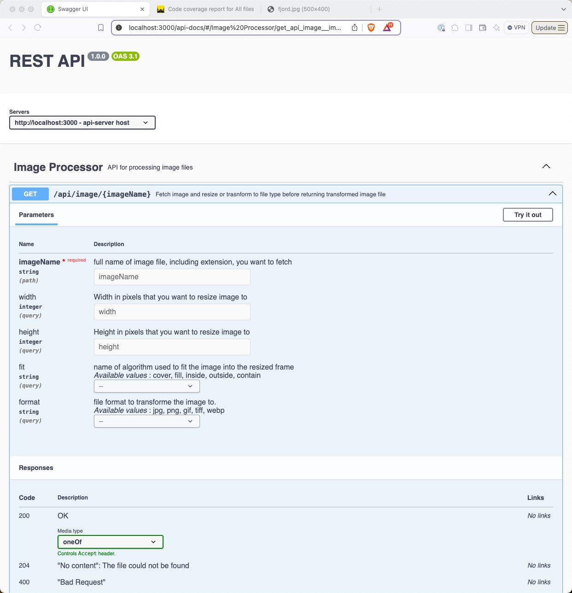
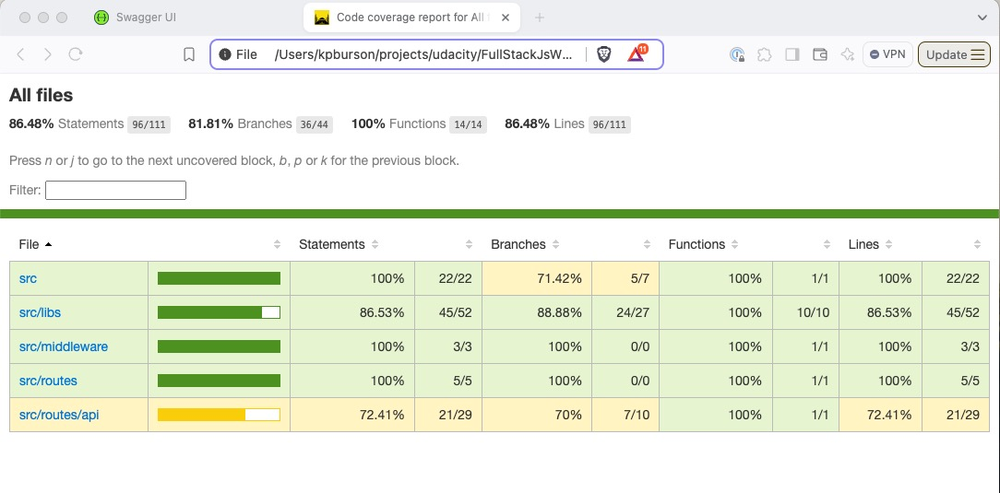

# Full Stack Developer

## Backend Web Service API with ExpressJS

The image service can handle multiple parameters to modify an image:

http://localhost:3000/api/image/{imageName}?width={int}&height={int}&fit={string}&format={string}

the only _required_ parameter is the url path param `{imageName}`. If this is not included the service will return a 404 [Bad Request].

The query string Parameters are:

- width:int resize the image to the request width
  - if the number is <= 0 || `NaN` then the original file width is used
- height:int resize the image to the request height
  - if the number is <= 0 || `NaN` then the original file height is used
- fit:string mask algorithm how to place the image within the resized frame
  - defaults to `fill`
  - if value given is not a valid fit algorithm then a 404 error is returned.
- format:string ability to change image format [ jpg, gif, png...]
  - if the value is not a valid format then a 404 error is returned.
  - If `format` is not provided then the format of the original image is used.

None of these are required, and if no parameters are given then the site will return the original image unmodified.

The filename of any thumbnails generated will contain these parameter values so the server can easily identify any images already generated and send those instead.

In the case the that {imageName} is not

### Additional Features:

#### Swagger UI

The projet workspace is configured to auto-generate an openAPi spec( swagger) and host a `swaggerUI` page to document the various API endpoints _[ that will eventually be ]_ configured for this server application.

The swagger spec is auto generated from the endpoint source files (_comments within_). You can regenerate this spec at any time using `npm run swagger`, which will store the output file in the `assets` folder. The build process copies the entire asset folder to the dist folder where the application is hosted using `npm start`.

#### Code Coverage Reports

the project is configured to generate html code coverage reports for the unit / integration testing. the reports are stored at the root level of the repo in the `reports` directory.

There is a convenience script to open the latest report in your default browser:

`npm view:coverage`

## Nx Workspace

This repository is an integrated mono repo using the Nx developer toolkit.

### Why a mono repo?

The final project will have many moving parts including separate backend and front end applications. Using the Mono Repo we can work with all multiple components and share source code more easily across applications.

For more information on [Why Nx Workspaces](https://nx.dev/getting-started/why-nx)

One of the hidden features of using Nx Workspaces is the build and test optimizations.

    The build management scripts leverage a project dependency map that identifies what scripts or modules are affected by any changes since the last commit and then allows you to build/test only those modules or applications - thus saving time from building/testing modules/features/applications that have not changed.

### Workspace structure

the `./apps` folder contains a folder for each independently deployable application, along with a secondary folder to contain end-to-end test cases and test helper functions. Each application is intended to be a small, light wrapper around shared code and functionality.

**Note**:

1. I have chosen to use `Jest` as the unit testing framework. I feel it is more prevalent and appropriate for nodejs unit testing, my secondary choices were `vitest` or `mocha`.
2. I have chosen to place the test files next to the source files and use file globbing to define which to include in the build or test phases.
   _This is a personal choice. I hate using a separate `__tests__` folder, it is so 1990s retro._
3. Test code coverage is high, but a few files I have decided not to take the arduous task of generating appropriate error conditions to test the error messages.

### management scripts

**Quick Start**

**Using Nx Console**

The easiest way to manage the application lifecycle is to use the **Nx Console** extension for VS Code. This will provide simple navigation of available commands to build, lint, format, test, serve, package...

**npm alias scripts**

I have created some npm scripts to make it easy to perform the basic tasks on this project without understanding the Nx DevTools framework.

| CLI                      | Description                                                             |
| ------------------------ | ----------------------------------------------------------------------- |
| `npm run build`          | build and save the development artifacts into the `dist` folder         |
| `npm run lint`           | run lint on all ts code                                                 |
| `npm run format`         | run prettier on all ts / md files. I have vscode set to format on save. |
| `npm test`               | run unt tests for api-server                                            |
| `npm test -- --watch`    | run unit tests for api-server and watch for file changes                |
| `npm test -- --coverage` | run unit tests for api-server and generate code coverage reports        |
| `npm e2e`                | run cypress for api-e2e files                                           |
| `npm start`              | build api-server and start as development server (auto-reloading)       |
| `npm run view:coverage`  | open the coverage report in the default browser                         |
| `npm run swagger`        | auto generate a swagger.json from typescript source files               |

### Demo

1. clone repo
2. inside repo install all npm dependencies: `npm i`
   - note: it is helpful, but not necessary, to have the nx tools installed globally: `npm i -g nx`
3. `npm run lint`
4. `npm run test -- --coverage`
   - `npm run view:coverage`
5. `npm start`
6. open browser to `http://localhost:3000/api-docs`
7. experiment with various parameter combinations.

### Using NX CLI

Each **nx** command takes on a familiar format:

    `npx nx run ${app-name}:${command} --{option}={value}`

The following are some lists of available values for the above parameters:

**applications**

1. api-server

( _Later we will have a front end application, and perhaps secondary applications to experiment with different frameworks for both front and back end, using a shared libs folder of vanilla typescript to reduce code redundancy_ )

**commands**

1. build
2. lint
3. test
4. e2e
5. serve

**configuration**

1. development
2. production

#### examples

##### Using the `affected` graph

**build all apps and dependencies affected by current file change**

- `nx affected --target=build`

**lint all deps affected by current file changes**

- `nx affected --target=lint`

**managing a specific project [api-server]**

- `npx nx run api-server:build`

- `npx nx run api-server:lint`
- `npx nx run api-server:test`

- `npx nx run api-server:serve --configuration=development`

### Notes

The difference between serve development and production is that development builds include source maps, production does not.
